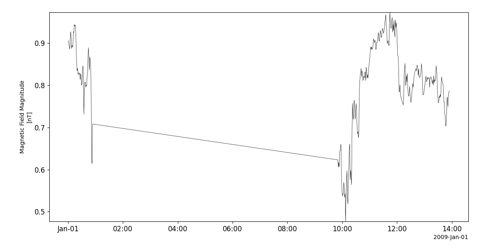
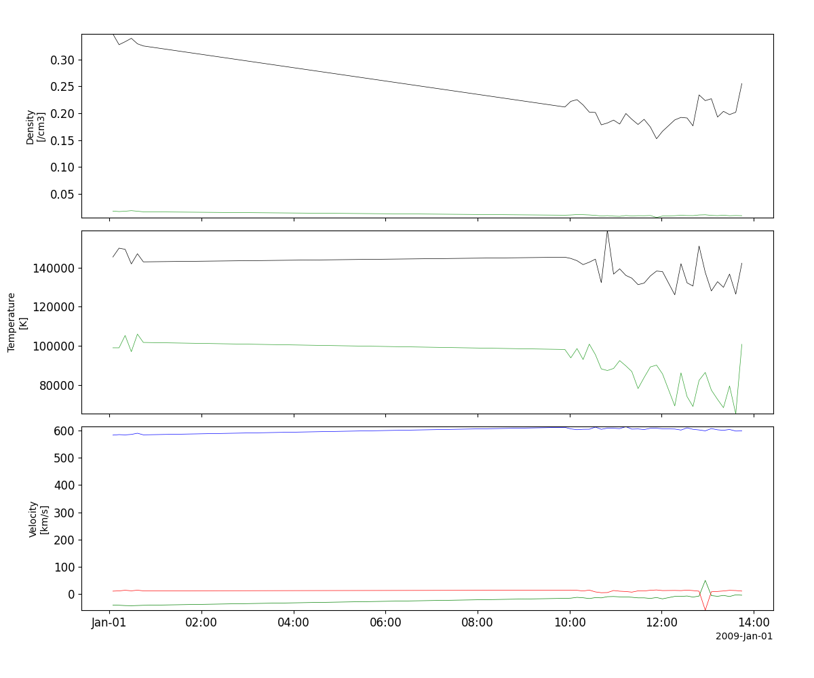
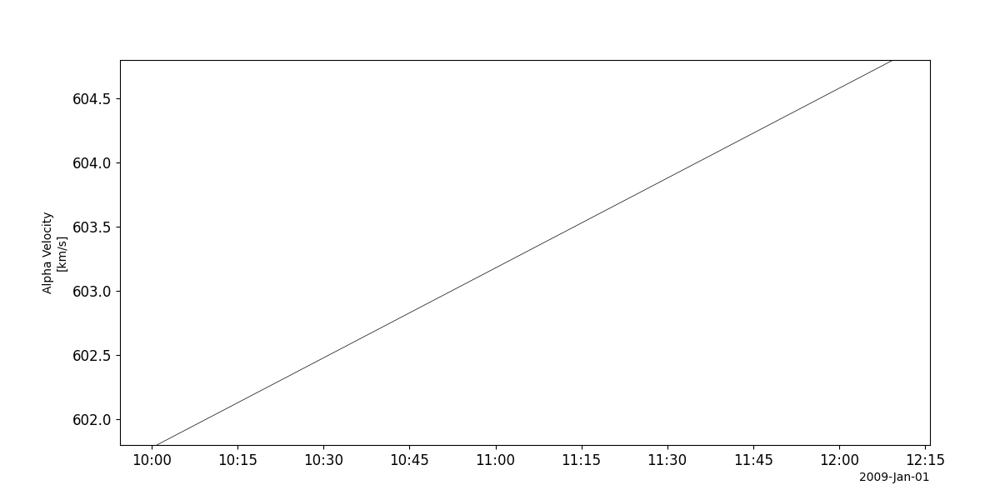
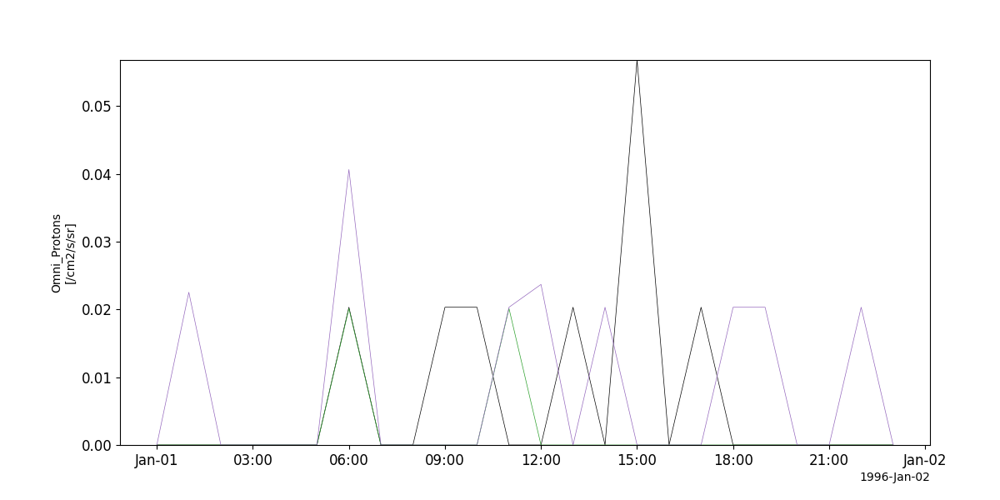
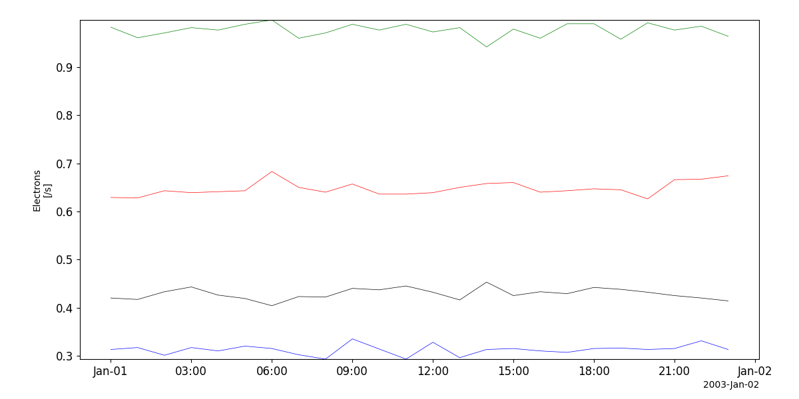
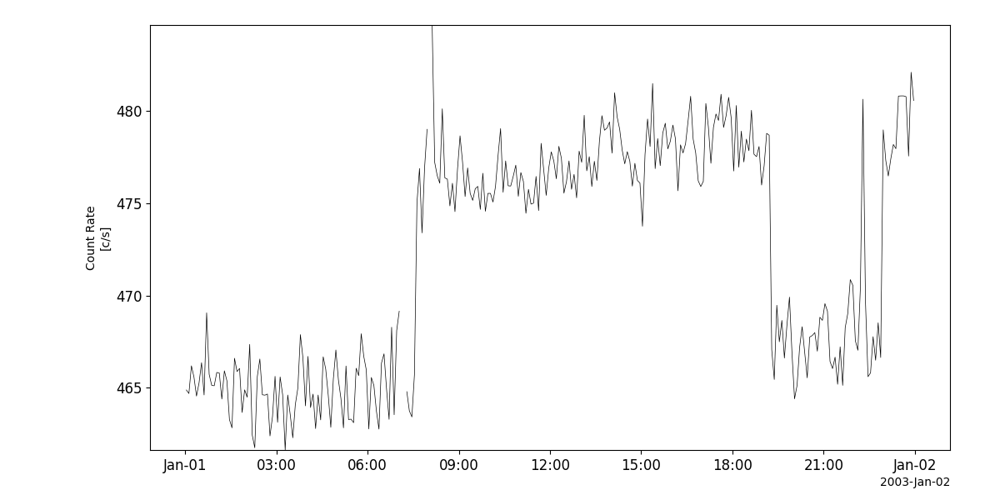

Ulysses
========================================================================
The routines in this module can be used to load data from the Ulysses mission.

Magnetic field (VHM)
----------------------------------------------------------
.. autofunction:: pyspedas.projects.ulysses.vhm

Example
^^^^^^^^^

.. code-block:: python
   
   import pyspedas
   from pyspedas import tplot
   vhm_vars = pyspedas.projects.ulysses.vhm()
   tplot('B_MAG')

Solar wind plasma (SWOOPS)
----------------------------------------------------------
.. autofunction:: pyspedas.projects.ulysses.swoops

Example
^^^^^^^^^

.. code-block:: python
   
   import pyspedas
   from pyspedas import tplot
   swoops_vars = pyspedas.projects.ulysses.swoops()
   tplot(['Density', 'Temperature', 'Velocity'])

Solar wind ion composition (SWICS)
----------------------------------------------------------
.. autofunction:: pyspedas.projects.ulysses.swics

Example
^^^^^^^^^

.. code-block:: python
   
   import pyspedas
   from pyspedas import tplot
   swics_vars = pyspedas.projects.ulysses.swics()
   tplot('Velocity')

Energetic particles (EPAC)
----------------------------------------------------------
.. autofunction:: pyspedas.projects.ulysses.epac

Example
^^^^^^^^^

.. code-block:: python
   
   import pyspedas
   from pyspedas import tplot
   epac_vars = pyspedas.projects.ulysses.epac()
   tplot('Omni_Protons')

Low-energy ions and electrons (HI-SCALE)
----------------------------------------------------------
.. autofunction:: pyspedas.projects.ulysses.hiscale

Example
^^^^^^^^^

.. code-block:: python
   
   import pyspedas
   from pyspedas import tplot
   hiscale_vars = pyspedas.projects.ulysses.hiscale()
   tplot('Electrons')

Solar X-rays and cosmic gamma-ray bursts (GRB)
----------------------------------------------------------
.. autofunction:: pyspedas.projects.ulysses.grb

Example
^^^^^^^^^

.. code-block:: python
   
   import pyspedas
   from pyspedas import tplot
   grb_vars = pyspedas.projects.ulysses.grb()
   tplot('Count_Rate')

