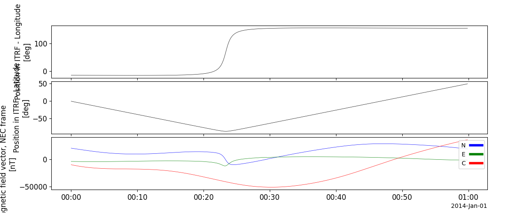

VIRES
=====
The routines in this module can be used to load data from the Swarm mission.
This module supports more data types than the Swarm module, which is limited to the
subset of data types available from the HAPI server.

About Access Tokens
-------------------

In order to use the VIRES service, users must sign up for a VIRES account and generate an access token.
See https://viresclient.readthedocs.io/en/latest/access_token.html for information about how to get an account
and generate a token.

PySPEDAS will first check for a VIRES_TOKEN environment variable containing the access token;
if not found, it will attempt to open the user's .viresclient.ini file and read it from there.

Loading data
------------
.. autofunction:: pyspedas.vires.data

Example: Show available collections
^^^^^^^^^^^^^^^^^^^^^^^^^^^^^^^^^^^

.. code-block:: python

    from viresclient import SwarmRequest
    from pyspedas.vires.config import CONFIG
    collections = SwarmRequest(url="https://vires.services/ows",token=CONFIG['access_token']).available_collections()
    print(collections)

Example output::

    General References:
     Swarm Data Handbook, https://earth.esa.int/web/guest/missions/esa-eo-missions/swarm/data-handbook
     The Swarm Satellite Constellation Application and Research Facility (SCARF) and Swarm data products, https://doi.org/10.5047/eps.2013.07.001
     Swarm Science Data Processing and Products (2013), https://link.springer.com/journal/40623/65/11/page/1
     Special issue “Swarm science results after 2 years in space (2016), https://www.springeropen.com/collections/swsr
     Earth's Magnetic Field: Understanding Geomagnetic Sources from the Earth's Interior and its Environment (2017), https://link.springer.com/journal/11214/206/1/page/1

    MAG
       SW_OPER_MAGA_LR_1B
       SW_OPER_MAGB_LR_1B
       SW_OPER_MAGC_LR_1B
     https://earth.esa.int/web/guest/missions/esa-eo-missions/swarm/data-handbook/level-1b-product-definitions#MAGX_LR_1B_Product

    MAG_HR
       SW_OPER_MAGA_HR_1B
       SW_OPER_MAGB_HR_1B
       SW_OPER_MAGC_HR_1B
    https://earth.esa.int/web/guest/missions/esa-eo-missions/swarm/data-handbook/level-1b-product-definitions#MAGX_HR_1B_Product

    EFI
       SW_OPER_EFIA_LP_1B
       SW_OPER_EFIB_LP_1B
       SW_OPER_EFIC_LP_1B
     https://earth.esa.int/web/guest/missions/esa-eo-missions/swarm/data-handbook/level-1b-product-definitions#EFIX_LP_1B_Product

    EFI_IDM
       SW_PREL_EFIAIDM_2_
       SW_PREL_EFIBIDM_2_
       SW_PREL_EFICIDM_2_
    https://earth.esa.int/eogateway/documents/20142/2860886/SLIDEM_Product_Definition.pdf

    EFI_TIE
       SW_OPER_EFIATIE_2_
       SW_OPER_EFIBTIE_2_
       SW_OPER_EFICTIE_2_
    https://earth.esa.int/eogateway/activities/swarm-ion-temperature-estimation

    EFI_TCT02
       SW_EXPT_EFIA_TCT02
       SW_EXPT_EFIB_TCT02
       SW_EXPT_EFIC_TCT02
    https://earth.esa.int/eogateway/documents/20142/37627/swarm-EFI-TII-cross-track-flow-dataset-release-notes.pdf

    EFI_TCT16
       SW_EXPT_EFIA_TCT16
       SW_EXPT_EFIB_TCT16
       SW_EXPT_EFIC_TCT16
    https://earth.esa.int/eogateway/documents/20142/37627/swarm-EFI-TII-cross-track-flow-dataset-release-notes.pdf

    IBI
       SW_OPER_IBIATMS_2F
       SW_OPER_IBIBTMS_2F
       SW_OPER_IBICTMS_2F
     https://earth.esa.int/web/guest/missions/esa-eo-missions/swarm/data-handbook/level-2-product-definitions#IBIxTMS_2F
     https://earth.esa.int/documents/10174/1514862/Swarm_L2_IBI_product_description

    TEC
       SW_OPER_TECATMS_2F
       SW_OPER_TECBTMS_2F
       SW_OPER_TECCTMS_2F
     https://earth.esa.int/web/guest/missions/esa-eo-missions/swarm/data-handbook/level-2-product-definitions#TECxTMS_2F
     https://earth.esa.int/documents/10174/1514862/Swarm_Level-2_TEC_Product_Description

    FAC
       SW_OPER_FACATMS_2F
       SW_OPER_FACBTMS_2F
       SW_OPER_FACCTMS_2F
       SW_OPER_FAC_TMS_2F
     https://earth.esa.int/web/guest/missions/esa-eo-missions/swarm/data-handbook/level-2-product-definitions#FAC_TMS_2F
     https://earth.esa.int/web/guest/missions/esa-eo-missions/swarm/data-handbook/level-2-product-definitions#FACxTMS_2F
     https://earth.esa.int/documents/10174/1514862/Swarm_L2_FAC_single_product_description
     https://earth.esa.int/documents/10174/1514862/Swarm-L2-FAC-Dual-Product-Description

    EEF
       SW_OPER_EEFATMS_2F
       SW_OPER_EEFBTMS_2F
       SW_OPER_EEFCTMS_2F
     https://earth.esa.int/web/guest/missions/esa-eo-missions/swarm/data-handbook/level-2-product-definitions#EEFxTMS_2F
     https://earth.esa.int/documents/10174/1514862/Swarm-Level-2-EEF-Product-Description

    IPD
       SW_OPER_IPDAIRR_2F
       SW_OPER_IPDBIRR_2F
       SW_OPER_IPDCIRR_2F
     https://earth.esa.int/web/guest/missions/esa-eo-missions/swarm/data-handbook/level-2-product-definitions#IPDxIPR_2F

    AEJ_LPL
       SW_OPER_AEJALPL_2F
       SW_OPER_AEJBLPL_2F
       SW_OPER_AEJCLPL_2F
    https://earth.esa.int/eogateway/activities/swarm-aebs

    AEJ_LPL:Quality
       SW_OPER_AEJALPL_2F:Quality
       SW_OPER_AEJBLPL_2F:Quality
       SW_OPER_AEJCLPL_2F:Quality
    No reference...

    AEJ_LPS
       SW_OPER_AEJALPS_2F
       SW_OPER_AEJBLPS_2F
       SW_OPER_AEJCLPS_2F
    https://earth.esa.int/eogateway/activities/swarm-aebs

    AEJ_LPS:Quality
       SW_OPER_AEJALPS_2F:Quality
       SW_OPER_AEJBLPS_2F:Quality
       SW_OPER_AEJCLPS_2F:Quality
    No reference...

    AEJ_PBL
       SW_OPER_AEJAPBL_2F
       SW_OPER_AEJBPBL_2F
       SW_OPER_AEJCPBL_2F
    https://earth.esa.int/eogateway/activities/swarm-aebs

    AEJ_PBS
       SW_OPER_AEJAPBS_2F
       SW_OPER_AEJBPBS_2F
       SW_OPER_AEJCPBS_2F
    https://earth.esa.int/eogateway/activities/swarm-aebs

    AEJ_PBS:GroundMagneticDisturbance
       SW_OPER_AEJAPBS_2F:GroundMagneticDisturbance
       SW_OPER_AEJBPBS_2F:GroundMagneticDisturbance
       SW_OPER_AEJCPBS_2F:GroundMagneticDisturbance
    No reference...

    AOB_FAC
       SW_OPER_AOBAFAC_2F
       SW_OPER_AOBBFAC_2F
       SW_OPER_AOBCFAC_2F
    https://earth.esa.int/eogateway/activities/swarm-aebs

    AUX_OBSH
       SW_OPER_AUX_OBSH2_
    https://doi.org/10.5047/eps.2013.07.011

    AUX_OBSM
       SW_OPER_AUX_OBSM2_
    https://doi.org/10.5047/eps.2013.07.011

    AUX_OBSS
       SW_OPER_AUX_OBSS2_
    https://doi.org/10.5047/eps.2013.07.011

    VOBS_SW_1M
       SW_OPER_VOBS_1M_2_
    https://earth.esa.int/eogateway/activities/gvo

    VOBS_SW_4M
       SW_OPER_VOBS_4M_2_
    https://earth.esa.int/eogateway/activities/gvo

    VOBS_CH_1M
       CH_OPER_VOBS_1M_2_
    https://earth.esa.int/eogateway/activities/gvo

    VOBS_CR_1M
       CR_OPER_VOBS_1M_2_
    https://earth.esa.int/eogateway/activities/gvo

    VOBS_OR_1M
       OR_OPER_VOBS_1M_2_
    https://earth.esa.int/eogateway/activities/gvo

    VOBS_CO_1M
       CO_OPER_VOBS_1M_2_
    https://earth.esa.int/eogateway/activities/gvo

    VOBS_OR_4M
       OR_OPER_VOBS_4M_2_
    https://earth.esa.int/eogateway/activities/gvo

    VOBS_CH_4M
       CH_OPER_VOBS_4M_2_
    https://earth.esa.int/eogateway/activities/gvo

    VOBS_CR_4M
       CR_OPER_VOBS_4M_2_
    https://earth.esa.int/eogateway/activities/gvo

    VOBS_CO_4M
       CO_OPER_VOBS_4M_2_
    https://earth.esa.int/eogateway/activities/gvo

    VOBS_SW_1M:SecularVariation
       SW_OPER_VOBS_1M_2_:SecularVariation
    No reference...

    VOBS_SW_4M:SecularVariation
       SW_OPER_VOBS_4M_2_:SecularVariation
    No reference...

    VOBS_CH_1M:SecularVariation
       CH_OPER_VOBS_1M_2_:SecularVariation
    No reference...

    VOBS_CR_1M:SecularVariation
       CR_OPER_VOBS_1M_2_:SecularVariation
    No reference...

    VOBS_OR_1M:SecularVariation
       OR_OPER_VOBS_1M_2_:SecularVariation
    No reference...

    VOBS_CO_1M:SecularVariation
       CO_OPER_VOBS_1M_2_:SecularVariation
    No reference...

    VOBS_OR_4M:SecularVariation
       OR_OPER_VOBS_4M_2_:SecularVariation
    No reference...

    VOBS_CH_4M:SecularVariation
       CH_OPER_VOBS_4M_2_:SecularVariation
    No reference...

    VOBS_CR_4M:SecularVariation
       CR_OPER_VOBS_4M_2_:SecularVariation
    No reference...

    VOBS_CO_4M:SecularVariation
       CO_OPER_VOBS_4M_2_:SecularVariation
    No reference...

    MIT_LP
       SW_OPER_MITA_LP_2F
       SW_OPER_MITB_LP_2F
       SW_OPER_MITC_LP_2F
    https://earth.esa.int/eogateway/activities/plasmapause-related-boundaries-in-the-topside-ionosphere-as-derived-from-swarm-measurements

    MIT_LP:ID
       SW_OPER_MITA_LP_2F:ID
       SW_OPER_MITB_LP_2F:ID
       SW_OPER_MITC_LP_2F:ID
    No reference...

    MIT_TEC
       SW_OPER_MITATEC_2F
       SW_OPER_MITBTEC_2F
       SW_OPER_MITCTEC_2F
    https://earth.esa.int/eogateway/activities/plasmapause-related-boundaries-in-the-topside-ionosphere-as-derived-from-swarm-measurements

    MIT_TEC:ID
       SW_OPER_MITATEC_2F:ID
       SW_OPER_MITBTEC_2F:ID
       SW_OPER_MITCTEC_2F:ID
    No reference...

    PPI_FAC
       SW_OPER_PPIAFAC_2F
       SW_OPER_PPIBFAC_2F
       SW_OPER_PPICFAC_2F
    https://earth.esa.int/eogateway/activities/plasmapause-related-boundaries-in-the-topside-ionosphere-as-derived-from-swarm-measurements

    PPI_FAC:ID
       SW_OPER_PPIAFAC_2F:ID
       SW_OPER_PPIBFAC_2F:ID
       SW_OPER_PPICFAC_2F:ID
    No reference...

    MAG_CS
       CS_OPER_MAG
    https://doi.org/10.1186/s40623-020-01171-9

    MAG_GRACE
       GRACE_A_MAG
       GRACE_B_MAG
    https://doi.org/10.1186/s40623-021-01373-9

    MAG_GFO
       GF1_OPER_FGM_ACAL_CORR
       GF2_OPER_FGM_ACAL_CORR
    https://doi.org/10.1186/s40623-021-01364-w

    MAG_GOCE
       GO_MAG_ACAL_CORR
    https://doi.org/10.5880/GFZ.2.3.2022.001

    MAG_GOCE_ML
       GO_MAG_ACAL_CORR_ML
    https://doi.org/10.5880/GFZ.2.3.2022.002

    MOD_SC
       SW_OPER_MODA_SC_1B
       SW_OPER_MODB_SC_1B
       SW_OPER_MODC_SC_1B
    No reference...

Example: Load SWARM-A magnetometer data
^^^^^^^^^^^^^^^^^^^^^^^^^^^^^^^^^^^^^^^

.. code-block:: python

    # Load SWARM-A magnetometer data
    import pyspedas
    from pytplot import tplot
    vires_vars = pyspedas.vires.load(trange=['2014-01-01T00:00', '2014-01-01T01:00'],
        collection="SW_OPER_MAGA_LR_1B",
        measurements=["F", "B_NEC"],
        models=["CHAOS-Core"],
        sampling_step="PT10S",
        auxiliaries=["QDLat", "QDLon"])
    tplot(['Longitude', 'Latitude', 'B_NEC'])

