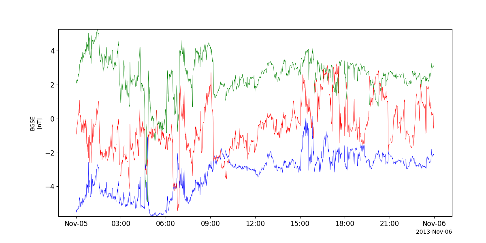
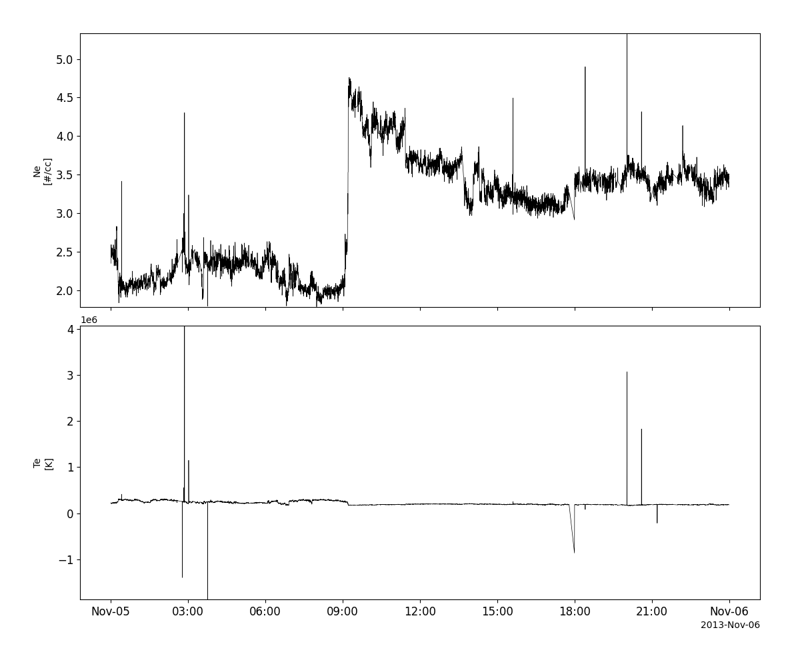
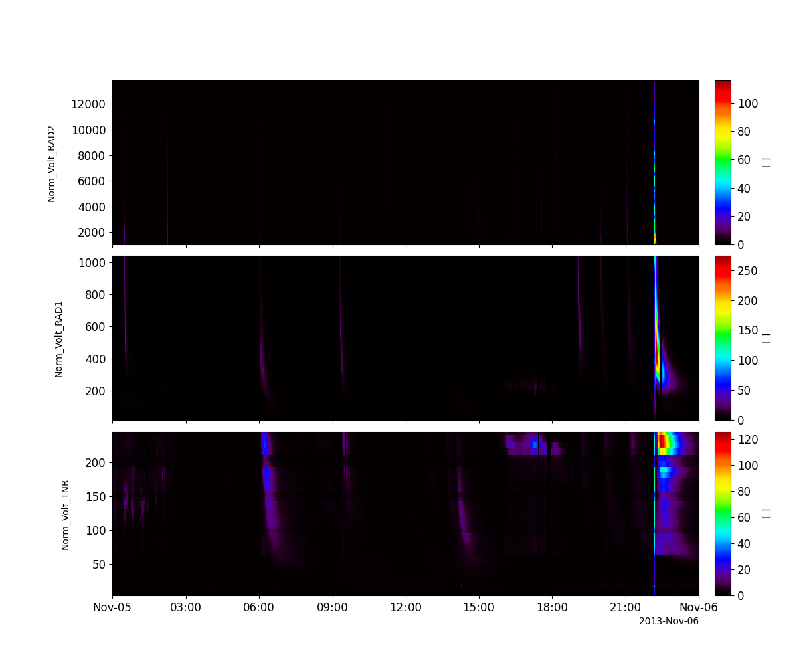
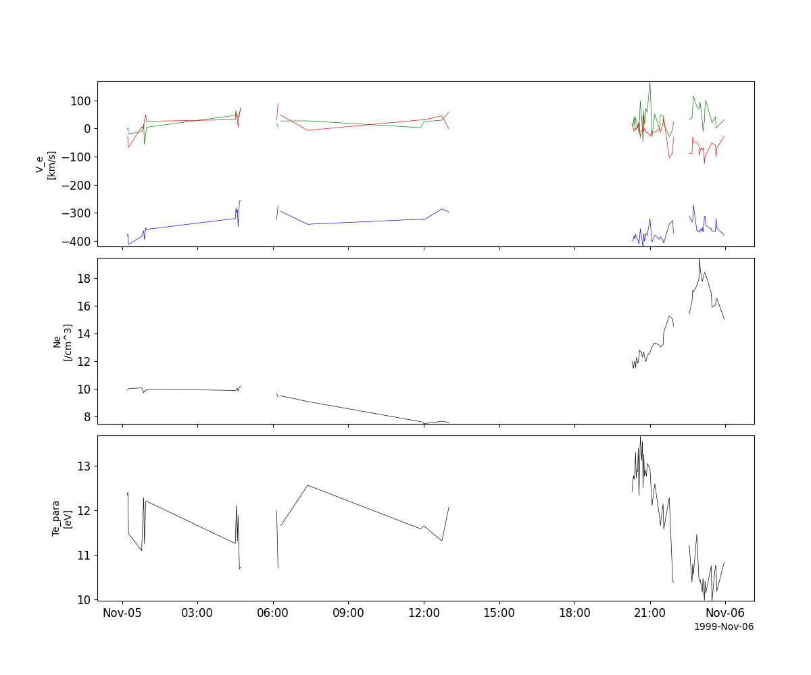
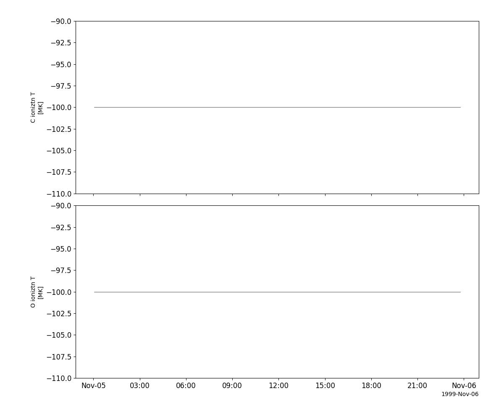
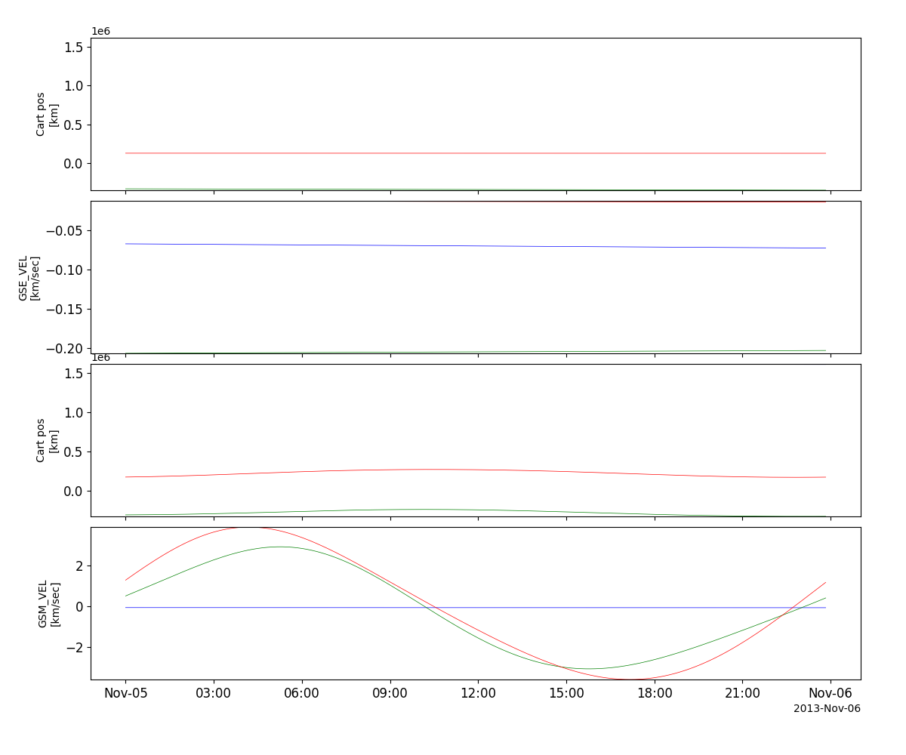

Wind Mission
========================================================================
The routines in this module can be used to load data from the Wind Mission mission.

Magnetic Field Investigation (MFI)
----------------------------------------------------------
.. autofunction:: pyspedas.wind.mfi

Example
^^^^^^^^^

.. code-block:: python
   
   import pyspedas
   from pytplot import tplot
   mfi_vars = pyspedas.wind.mfi(trange=['2013-11-5', '2013-11-6'])
   tplot('BGSE')

Solar Wind Experiment (SWE)
----------------------------------------------------------
.. autofunction:: pyspedas.wind.swe

Example
^^^^^^^^^

.. code-block:: python
   
   import pyspedas
   from pytplot import tplot
   swe_vars = pyspedas.wind.swe(trange=['2013-11-5', '2013-11-6'])
   tplot(['N_elec', 'T_elec'])

Radio and Plasma Waves (WAVES)
----------------------------------------------------------
.. autofunction:: pyspedas.wind.waves

Example
^^^^^^^^^

.. code-block:: python
   
   import pyspedas
   from pytplot import tplot
   waves_vars = pyspedas.wind.waves(trange=['2013-11-5', '2013-11-6'])
   tplot(['E_VOLTAGE_RAD2', 'E_VOLTAGE_RAD1', 'E_VOLTAGE_TNR'])

3D Plasma Analyzer (3DP)
----------------------------------------------------------
.. autofunction:: pyspedas.wind.threedp

Example
^^^^^^^^^

.. code-block:: python
   
   import pyspedas
   from pytplot import tplot
   threedp_vars = pyspedas.wind.threedp()
   tplot(['V_e_xyz_gse_wi_3dp', 'N_e_dens_wi_3dp', 'T_e_par_wi_3dp'])

Solar Wind and Suprathermal Ion Composition Experiment (SMS)
----------------------------------------------------------
.. autofunction:: pyspedas.wind.sms

Example
^^^^^^^^^

.. code-block:: python
   
   import pyspedas
   from pytplot import tplot
   sms_vars = pyspedas.wind.sms()
   tplot(['C_ion_temp', 'O_ion_temp'])

Orbit data
----------------------------------------------------------
.. autofunction:: pyspedas.wind.orbit

Example
^^^^^^^^^

.. code-block:: python
   
   import pyspedas
   from pytplot import tplot
   orb_vars = pyspedas.wind.orbit(trange=['2013-11-5', '2013-11-6'])
   tplot(['GSE_POS', 'GSE_VEL', 'GSM_POS', 'GSM_VEL'])

